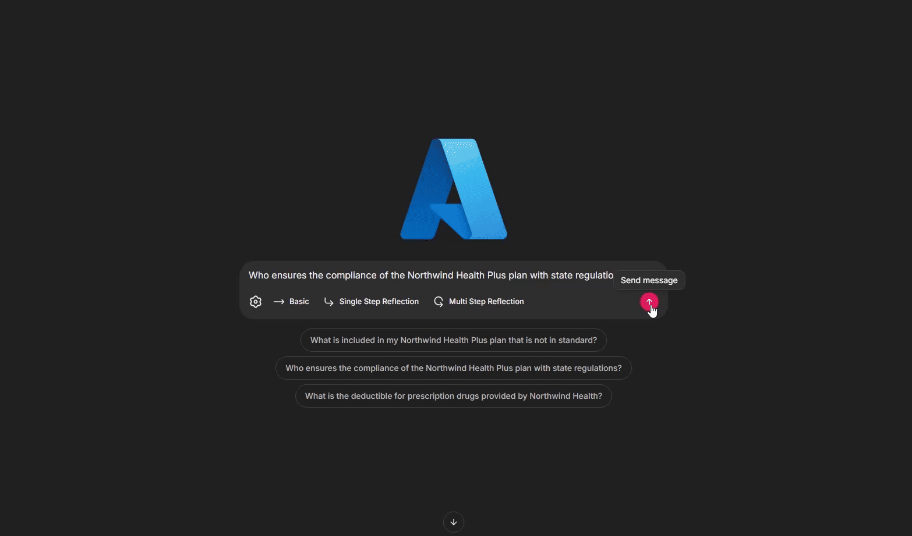

# Agentic RAG  (Azure AI Search)  

The code first creates a sample index, then demonstrates 3 sample Agentic RAG strategies to query it:
1. Basic (No Reflection Included)
2. Single Step Reflection
3. Multi Step Reflection

## Prerequisites

- An Azure subscription, with [access to Azure OpenAI](https://aka.ms/oai/access).

- An [Azure AI Fondry Project](https://learn.microsoft.com/azure/ai-foundry/how-to/create-projects)

- [Bing Grounding](https://learn.microsoft.com/azure/ai-services/agents/how-to/tools/bing-grounding) to access public data on the web

- Azure AI Search, any version, but make sure search service capacity is sufficient for the workload. We recommend Basic or higher for this demo.

- A deployment of the `text-embedding-3-large` embedding model in your Azure OpenAI service. As a naming convention, we name deployments after the model name: "text-embedding-3-large".

- A deployment of a at least one [chat completion model](https://learn.microsoft.com/azure/ai-services/openai/how-to/chatgpt) in your Azure OpenAI service. You can try `gpt-4o-mini` for answer generation and query rewriting, and `gpt-4o` for evaluation and reflection.

- Python (these instructions were tested with version 3.11.x)

We used Visual Studio Code with the [Python extension](https://marketplace.visualstudio.com/items?itemName=ms-python.python) to test this sample.

### Setup Instructions

1. Ensure your python environment is setup. You might want to setup a [virtual environment](https://code.visualstudio.com/docs/python/environments)
1. Install requirements from `requirements.txt`: `pip install -r requirements.txt`
1. Copy `sample.env` to `.env` and fill out all environment variables. You do not need to provide a Search key if you are using [keyless](https://learn.microsoft.com/azure/search/search-security-rbac) authentication, but you must provide an Azure OpenAI key
1. Run the ingestion script to setup your sample index: `python ingest.py`

## Run the code

1. Run the sample app to interact with the sample index: `chainlit run app.py`
1. Navigate to `http://localhost:8000` to chat
1. You can load a sample conversation using the settings button
1. You can select which Agentic RAG strategy to use to answer any question

## Demo

